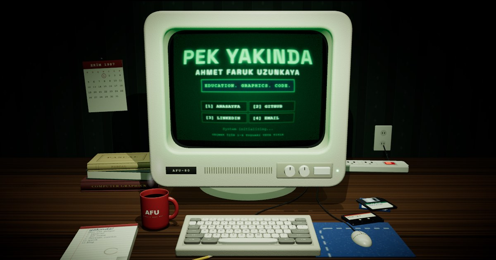

# AFU Coming Soon

A modern and interactive "Coming Soon" page featuring retro CRT TV screen effects, glitch animations, and custom cursor design that delivers a stunning user experience.



## 🏷️ Tags

`nextjs` `react` `typescript` `threejs` `coming-soon` `retro` `crt-effect` `glitch-animation` `custom-cursor` `docker` `modern-ui` `interactive` `full-stack-developer` `computer-graphics` `geek`

## 🚀 Features

- **Retro CRT TV Effect**: Realistic old television screen appearance
- **Glitch Animations**: RGB color shift and text glitch effects
- **Custom Cursor**: Interactive and animated custom mouse cursor
- **3D Scene**: Real-time three.js desk scene on desktop (CSS fallback on mobile / without WebGL)
- **Social Media Integration**: GitHub, LinkedIn, and Email links
- **Responsive Design**: Mobile and desktop compatible
- **Docker Support**: Docker configuration for easy deployment
- **Performance Optimization**: Optimized with Next.js 16 and React 19

## 🛠️ Technologies

- **Framework**: Next.js 16
- **UI Library**: React 19
- **Language**: TypeScript 5
- **Styling**: CSS Modules
- **3D**: three.js, React Three Fiber
- **Build Tool**: Turbopack
- **Containerization**: Docker & Docker Compose

## 📦 Installation

### Requirements

- Node.js 20.9+ (or Docker)
- npm, yarn, or pnpm
- Docker (optional)

### Local Installation

1. Clone the repository:
```bash
git clone <repository-url>
cd afu-coming-soon
```

2. Install dependencies:
```bash
yarn install
# or
npm install
```

3. Start the development server:
```bash
yarn dev
# or
npm run dev
```

4. Open [http://localhost:3000](http://localhost:3000) in your browser.

## 🐳 Running with Docker

### Using Docker Compose

```bash
docker-compose up -d
```

The application will run at [http://localhost:8085](http://localhost:8085).

### Manual Build with Dockerfile

```bash
docker build -t afu-coming-soon .
docker run -p 3000:3000 afu-coming-soon
```

## 📂 Project Structure

```
afu-coming-soon/
├── src/
│   ├── app/
│   │   ├── page.tsx           # Main page (CRT scene with "PEK YAKINDA")
│   │   ├── not-found.tsx      # 404 page (same scene, "404" on screen)
│   │   ├── layout.tsx         # Root layout
│   │   └── globals.css        # Global styles
│   ├── components/            # One file per component, its .module.css next to it
│   │   ├── crt-page.tsx       # Shared CRT scene page (3D on desktop, CSS on mobile)
│   │   └── crt-scene/         # three.js scene (lazy-loaded)
│   ├── hooks/
│   └── constants/             # Social links
├── public/
│   ├── favicon.js            # Dynamic favicon
│   └── favicon.svg           # Favicon SVG
├── Dockerfile                # Docker build file
├── docker-compose.yml        # Docker Compose configuration
├── eslint.config.mjs         # ESLint (typescript-eslint + react-hooks)
├── tsconfig.json             # TypeScript configuration
└── package.json              # Project dependencies
```

## 🎨 Customization

### Changing Texts

Screen texts live in the `TEXT` object of `src/app/page.tsx` (and `src/app/not-found.tsx` for the 404 page).

### Updating Social Media Links

Edit `SOCIAL_LINKS` in `src/constants/social-links.ts`. Icons are inline SVGs in `src/components/icon.tsx`.

## 🚢 Production Build

```bash
yarn build
yarn start
```

## 📝 Scripts

- `yarn dev`: Starts the development server
- `yarn build`: Creates a production build
- `yarn start`: Starts the production server
- `yarn lint`: Checks code quality with ESLint

## 🔧 Configuration

### TypeScript

TypeScript configuration is located in the `tsconfig.json` file. Strict mode is enabled and path aliases (`@/*`) are configured.

## 🌐 Deployment

### Vercel (Recommended)

1. Log in to your Vercel account
2. Import the project
3. Build command: `yarn build`
4. Output directory: `.next`
5. Deploy

### Docker on Any Platform

```bash
docker build -t afu-coming-soon .
docker push <your-registry>/afu-coming-soon
```

## 🎯 Feature Details

### CRT TV Effect
- Screen glass effect
- Scanlines
- Noise effect
- 3D perspective

### Glitch Animations
- RGB color shift
- Text glitch effects
- Icon glitch animations
- Dynamic clip-path usage

### Interactive Features
- Custom cursor design
- Hover effects
- Smooth animations
- Responsive design
